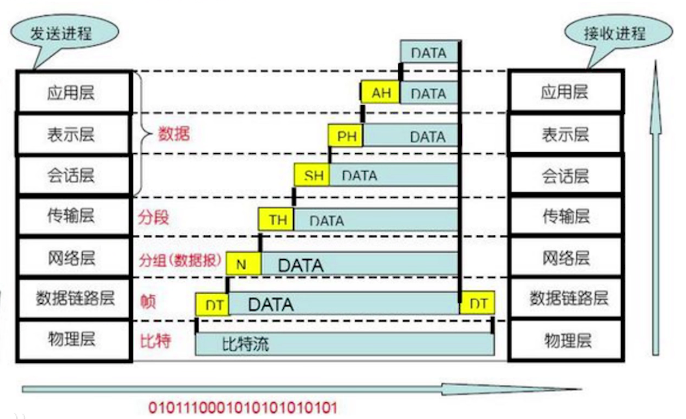

# Hub集线器(物理层)
* 让设备自己判断消息来源(效率低)
* CSMA/CD协议

# SW交换机(数据链路层)
* 类似集线器 
* 数据转发
* 记录地址(Mac地址,48bit),端口;通过维系mac端口映射表(大约几千),mac--端口 映射关系
* 使用网线,数据不会冲突,通过遍历端口记录消息回应的端口记录表
* 多个Mac地址可对应同一端口,桥接
  
# 路由器(网关,网络层) 
* 连接网络
* 拥有路由表
* 有对内对外IP
    ## IP地址
    * 标识网络
    * 标识设备
    ## ARP协议
    * 通过IP地址查找Mac地址 
    * 
